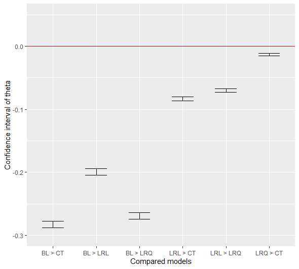
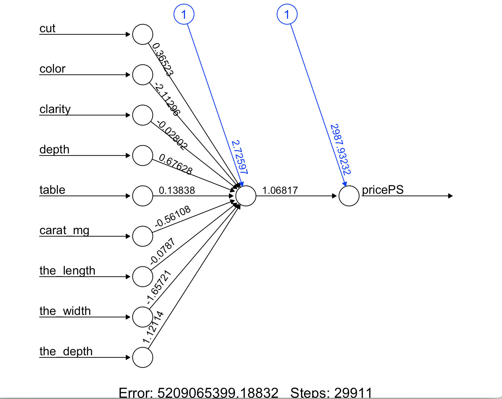
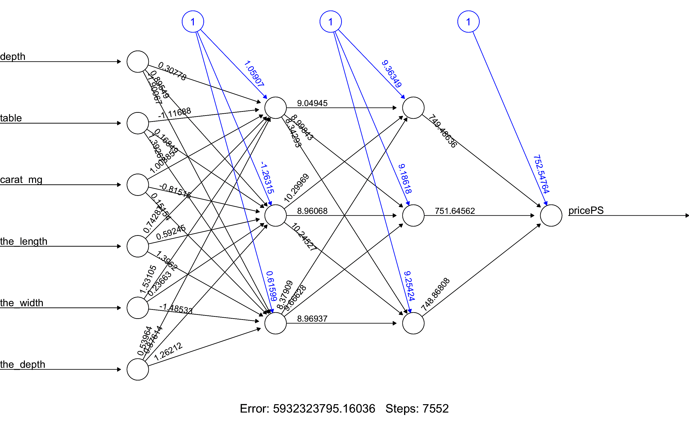

\maketitle

```{r setup, include=FALSE}
knitr::opts_chunk$set(echo = TRUE)
```

```{r echo=FALSE, fig.align='center', out.width='30%'}
# Include images and pictures using .png files.
knitr::include_graphics(c("Images/The_Black_Logo.png"))
```

```{r echo=FALSE,  fig.alt='left', fig.show='asis', out.width='37%'}
# Include images and pictures using .png files.
knitr::include_graphics(c("Images/Space.png"))
```

```{r echo=FALSE,  fig.alt='left', fig.show='asis', out.width='50%'}
# Include images and pictures using .png files.
knitr::include_graphics(c("Images/Diamond3.png", "Images/Diamond3.png"))
```

\newpage

```{=latex}
\newpage
\setcounter{tocdepth}{3}
\tableofcontents
```

\newpage

# Contribution Table

Task           |     Oriade    |     Pietro    |
---------------|:-------------:|:-------------:|
**Student ID** |   s172084     |    s231756    |
---------------|---------------|---------------| 
Question A.1   |       x       |               |   
---------------|---------------|---------------|
Question A.2   |       x       |               | 
---------------|---------------|---------------|
Question A.3   |       x       |               | 
---------------|---------------|---------------|
Question B.1   |       x       |               |  
---------------|---------------|---------------|
Question B.2   |       x       |               |
---------------|---------------|---------------|
Question B.3   |       x       |               |
---------------|---------------|---------------|
Question C.1   |               |       x       |
---------------|---------------|---------------|
Question C.2   |               |       x       |
---------------|---------------|---------------|
Question C.3   |               |       x       |
---------------|---------------|---------------|
Question C.4   |               |       x       |
---------------|---------------|---------------|
Question C.5   |               |       x       |
---------------|---------------|---------------|
Exam Problem 1 |       x       |               | 
---------------|---------------|---------------|
Exam Problem 2 |               |       x       |
---------------|---------------|---------------|
Exam Problem 3 |       x       |               |
---------------|---------------|---------------|
Exam Problem 4 |               |       x       |
---------------|---------------|---------------|
Exam Problem 5 |       x       |               |
---------------|---------------|---------------|
Exam Problem 6 |               |       x       | 
------------------------------------------------
                    - https://github.com/s172084/MachiNe_LeaRninG/tree/main


\newpage

# REGRESSION
## Section A
### Question 1

**Linear Regrerssion : Explain what is predicted based on which other variables, and what you hope to accomplish by the regression.**
**Mention your feature transformation choices such as 1 out of K coding.**
**Apply a feature transformation to your data matrix X, such that each column has a mean of 0 and a standard deviation of 1**

This project uses the Diamonds Dataset[^1] from The Grammar of Graphics (**ggplot2**) package, which is part of the TidyVerse package. The Diamonds Dataset contains the Prices and other attributes of over 50,000 round cut diamonds. The package was created by Hadley Wickham and other data scientists to be used with the statistical programming language called R .

[^1]: Agrawal, S. Analyze diamonds by their cut, color, clarity, price, and other attributes. Diamond Competition, 2017 (accessed 14 November
2023). https://www.kaggle.com/datasets/shivam2503/diamonds/data

Multiple Linear Regression is performed in order to predict the Price of a Diamond based on the other attributes. In this section,  the subgroup of diamonds under analysis come from the **Premium Group** in the colour category **D**. 
This subgroup of diamonds have a varied clarity. 

The continuous attributes such as the carat, the table, the length, the width and the depth of a diamond are used to estimate the price of the diamond. The **“SLM Calculate a prediction”** function takes new observation of a diamond that is 142 mg in weight and predicts that the price of that diamond is £2,909 or approximately DKK 24,830 . 

In terms of feature transformations, the price of a diamond is converted from United States Dollars ($) to Danish Kroner (DKK) , (€) Euro and (£) Pound Sterling. The categorical discrete attributes of diamond colour, diamond clarity and diamond cut have either been removed or one hot encoded for linear regression. This is due to issues with multicollinearity of the dummy variables. 

The measurements of diamond length, width and depth were converted from millimetres (mm) to micrometers (µm). Carat was converted to milligrams (mg) and the outliers, which are the values that lie outside of the upper boundary and lower boundaries, were removed.The actual depth is called $z$. However, the *total depth percentage* is also called *depth* and it represents: $$\frac{depth} {mean( length * width)}$$

In the dataset there are diamonds with a length, width or depth of 0.0 . The smallest measured depth is 1,070 µm and exactly two diamonds have a width of 3,730 µm. The “determine outliers”  function was used to estimate the upper and lower limits to be able to deal with outliers. It was important to deal with outliers, by removing them, due to the fact that these measurements may distort the statistical linear model. 


### Question 2

**Introduce a lambda regularisation parameter from the lecture notes. Estimate the generalisation error for the** **different values of lambda. Choose a range of lambda where the generalisation error first drops and then** **increases. For each value, use K = 10 Fold cross-validation to estimate the generalisation error. Include a** **figure of the estimated generalisation error as a function of lambda for the report and discuss the result.**

The lambda regularisation hyper-parameter was introduced. L2 Regularisation was performed using a general linear model from the glmnet package. The lambda regularisation parameter manages the trade off between the bias and the variance as large coefficients are penalised. 
K = 10 Cross Validation was used to find the optimal lambda. This optimal lambda can then be used downstream in a ridge regression model. The graph (figure A II) shows a drop in the Mean Squared Error and then a steady increase. Lambda controls the amount of regularisation that is applied to the model. The lambda that was used for regularisation is the optimal lambda obtained from cross validation based on the range of lambdas from 
$10 ^{-0.5}$ to $10^1$ . The optimal lambda is 1.353.(see figure A I and A II in the Appendix)

### Question 3
**Explain how the output (y) from the linear model with the smallest generalisation**
**error is computed using X. What is the effect of an individual attribute x on the** 
**output y of the linear model? Does the effect of the individual attribute make sense**
**based on your understanding of the problem?**

In Ridge Regression above, it is possible to calculate $\hat{y}$ using the coefficients and the lambda regularisation parameter.  $X$ is the matrix of input attributes and lambda is used to shrink the coefficients in order avoid over-fitting the model. It is important not to over-fit the model in order to keep the accuracy high. 
The formula for Ridge Regression performed in 2(a) is :

$$Y_{ridge} = X \cdot  (X'X + \lambda I)^ {-1}{X'Y}$$
The Figure B shows that the carat is the attribute with the highest permutation importance and the highest variable importance. 

The output variable $Y$ is the Price of  the diamond. To compute the Price of the diamond for a linear model, the following equation can be used: 

$$\hat{y} =  \sum_{i = 0}^{n} x_{i} * \beta_{i} + \epsilon $$
$$ Price = \beta_{0} + ( \beta_{1} * total.depth.percentage) + (\beta{2} * table)  + (\beta{3} * carat) + (\beta{4} * length ) + (\beta{5} * width ) + (\beta{6} * depth)$$
$\hat{y}$ is based on a linear model and also on the input variables (attributes) inside of the Matrix X. The effect of each of the attributes on the Price is determined by the coefficients associated with each of the attributes in the linear model. The coefficients indicate how much each attribute contributes to the prediction of the diamond Price. The positive coefficients indicate a positive relationship and the negative coefficients indicate a negative relationship.  For example, as the carat increases so too does the Price of the diamond . As the length increases, the Price of the diamond decreases.


## Section B
**In this section is a comparison of 3 models : A baseline model , A regularised linear** **regression model and an Artificial Neural Network.**
**Is one model is better than the other? Is the model better than the baseline ?**

### Question 1
**Implement two level cross validation to compare the models with** $K_{1} = K_{2} = 10$ **folds.For the baseline** **model, apply linear regression with no features. Compute the mean of **$ y $ **on the training data and use this** **value to predict** $y$ **on the test data. Fit an Artificial Neural Network model to the data. Select a** **reasonable range of values for (h) hidden layers in the model. Describe the range of values you will use**
**for **$h$ **and **$\lambda$.

The lowest Mean Squared Error Value indicates a better model performance. The model with the lowest Mean Squared Error is considered the best model in terms of prediction accuracy on the diamonds dataset. If the difference in Mean Squared Error between to models is negligible then statistical tests can be performed to see if there is a statistically significant difference between the Price predictions. 

The range of values for $h$ indicate the number of hidden layers in the Neural Network. 
The vector of [1] indicates 1 hidden layer, with 1 node in the Neural Network (see Figure D in the Appendix) . The vector of [3, 3] indicates 2 hidden layers with 3 nodes in each respective layer of this Artificial Neural Network (see figure E in the Appendix) . 

The lambda that was used for regularisation is the optimal lambda obtained from cross validation based on the range of lambdas from $10^{-0.5}$ to $10^{1}$. 

### Question 2 
**Produce a table similar to Table 1 using two level cross validation.The table should show for each of the K = 10 folds** **the optimal value of the number of hidden units and the regularisation strength** $h_{i}^*%$ **and** $\lambda_{i}^*$ **respectively as found after each inner loop, as well as the estimated generalisation errors by evaluating on the test** **data. It should include the baseline test error, evaluated on the test data. Re-use the train test splits for all 3** **methods to allow statistical comparison. The error measure is the squared loss per observation.**

**Include a Table in the report and briefly discuss what it tells you at a glance.**


 |             | Neural Network     |                    |Ridge Regression  |                    |                 | Baseline         |
 |-------------|:-------------------|------------------- |------------------|--------------------|-----------------|------------------|
 |             |                    |                    |                  |                    |                 |                  |
 | Outer Fold  | decay $h_{i}^{*}$  | MSE $E_i^{test}$   |  alpha $\alpha$  |  lambda $\lambda_i^{*}$|MSE $E_i^{test}$ | MSE $E_i^{test}$ | 
 |_____________|____________________|____________________|__________________|____________________|_________________|------------------|
 | Fold 1      |                0   | 1270785            |  0.8             | 1.509              | 1386461         |    9060134.      |
 | Fold 2      |              0.4   | 1289627            |  1.0             | 1.522              | 1385472         |    9060134       |
 | Fold 3      |              0.2   | 1292015            |  0.7             | 1.530              | 1384592         |    9060134.      |
 | Fold 4      |                1   | 1301900            |  0.8             | 1.514              | 1384023         |    9060134.      |
 | Fold 5      |              0.6   | 1302977            |  0.9             | 1.515              | 1383483         |    9060134.      |
 | Fold 6      |              0.2   | 1305577            |  0.9             | 1.518              | 1382991         |    9060134.      |
 | Fold 7      |              0     | 1308757            |  0.7             | 1.510              | 1382800         |    9060134.      |
 | Fold 8      |              0.4   | 1317249            |  0.8             | 1.517              | 1382791         |    9060134.      |
 | Fold 9      |              0.6   | 1326146            |  1.0             | 1.462              | 1382797         |    9060134.      |
 | Fold 10     |              0.8   | 1332439            |  0.9             | 1.484              | 1382814         |    9060134.      |

The Neural Network has the lowest Generalisation Error so therefore it is the model with the better performance. The Baseline Model has the worst performance and the Regularised Model is in the middle.

### Question 3 
**Statistically Evaluate if there is a significant performance difference between the fitted ANN, linear regression model and baseline, using the methods in Chapter 11.**
**These comparisons are to be made pairwise:**
  - **ANN vs. Linear Regression**
  - **ANN vs Baseline**
  - **Linear Regression vs. Baseline**
**Choose Setup 1 Section (11.3) and use the paired t-test described in box 11.34**
**Include Confidence intervals and P-values and for the three pairwise tests in the report and conclude the results.**
**Is one model better than the other? Are the two models better than the baseline?**
**Are some of the models identical?**
**What recommendations would you make based on what you've learned?**

The paired t-test is used to determine if the mean difference between two sets of observations is zero. The differences have a Normal Distribution. The Null Hypothesis $H_{0}$ is that the mean of the differences is 0, whereas the alternative hypotheses $H_{1}$ is that the mean of the differences is not 0. The p-value indicates whether the difference in mean squared errors between the models, or predictions, is statistically significant.

Evaluation of the values from the Artificial Neural Network against the values from the Baseline show that the p-value is less than 2.2e-16. This indicates that the null hypothesis can be rejected. (see the Code.R file)

Evaluation of the values from the Regularised Linear Regression against values from the Baseline, show that the p-value is 1. This indicates that the null hypothesis can be accepted. 

Evaluation of the values from the Artificial Neural Network against the Regularised Linear Regression, show that p-value is 2.2e-16. This indicates that the null hypothesis can be rejected.

# CLASSIFICATION

## Question 1

:::::: {.cols data-latex=""}
::: {.col data-latex="{0.45\textwidth}"}
Regarding the classification problem, we want to train a model which labels whether a diamond has an *Ideal cut* or not. This aim appears to be feasible according to the projection of data onto the space defined by the first three Principal Components (top figure of page 11 of Report 1). Figure L represents a sample of diamonds projected into the space defined by the second and third Principal Component. It can be seen that by colouring data according to their *cut*, they appear to be clustered, especially the *Ideal* ones. So we aim to find a model which classifies diamonds in two binary classes: *Ideal* and *Non-Ideal* cut, according to their depth, table, price in DKK, carat in milligrams, length, width and depth in micrometers. We choose to use only continuous attributes and to ignore information coming from the color and clarity of diamonds.
:::

::: {.col data-latex="{0.05\textwidth}"}
\ 
:::

::: {.col data-latex="{0.50\textwidth}"}


<span class="caption">Figure L: Sample of diamonds projected onto the space defined by the $2^{nd}$ and $3^{rd}$ Principal component</span>

:::
::::::
\ 

The dataset seems to be almost balanced in the distribution of diamonds between the *Ideal Cut* and the *Non-Ideal Cut*: the number of *Ideal* diamonds is about 21000 (corresponding to the 40 % of the dataset) whereas *Non-Ideal* diamonds are about 32000 (60 % of the dataset). This means that there is no need to re-sample the dataset since the predictors have enough observations of both the possible outcomes.

## Question 2 & 3
Different models can be trained to classify diamonds in *Ideal* and *Non-Ideal* cut. The simplest one is the Baseline (BL), based only on the vector **y** of the outputs. In our case it is represented by the attribute *cut* transformed as follow:
$$ y =
\begin{cases}
1 & \text{if cut = "Ideal"} \\
0 & \text{otherwise}
\end{cases} $$
By computing the average of **y**, we obtain the value of 0.4 (as we found in Question 1). According to this information, the BL model always predicts a new diamond as *Non-Ideal*, regardless its characteristics (depth, table, etc...), with a classification error of 40%. 

The other three models we want to analyse are:

- the Logistic Regression based on a linear combination of the attributes (LRL)
- the Classification Tree (CT)
- the Logistic Regression based on a quadratic combination of the first four Principal Components of the dataset (LRQ)

The choice of training a forth model is made because a quadratic combination of the 7 considered attributes is very hard to be trained (26 new columns representing the quadratic model would be added to the dataset, resulting in an **X** matrix of 33 columns): the computational time is too high and the process does not converge to a solution. So, by reducing the dimensions of the problem thanks to the Principal Component Analysis, we can consider a quadratic combination of the first four Principal Components (the **X** matrix turns out to have only 14 columns).

Each of the three above models requires a complexity parameter managing the regularization of the model. Higher values of the complexity parameter mean that large weights are penalized and data are less important in the training of the model. On the other hand, lower values of the complexity parameters allow the model to better follow data but to be less general in case of new data. 

- Logistic regression models (LRL and LRQ) are regularized by the $\lambda$ parameter, for which we do not know the value. Its value can be chosen by training the same model on the same data but with different values of $\lambda$. As the dataset consists of 53879 diamonds after the cleaning from the outliers, only four values of $lambda$ have been tempted in the training of the LRL and LRQ models. The tempted values are: $\lambda=\{10^{-5},10^{-4},10^{-3},10^{-2}\}$ (the choice of considering so low values is discussed later). We will choose the $\lambda$ associated to the lowest generalization error computed on a dataset of diamonds independent from the one used to train the model.
- Classification Tree is regularized by the $c_P$ parameter (note that $c_P\in[0,1]$). $c_P$ close to zero means more complex decision trees and more importance of data, $c_P$ close to 1 means easier decision trees and less importance to data. The selection of the best value of $c_P$ is the same of the Logistic Regression. The tempted values are: $c_P=\{0.05,0.01,0.005,0.001\}$. In addition, CT is dependent on two more parameters, that are the minimum number of data to create a new node (question) and the minimum number of data to create a leaf. The choice have been arbitrary made by taking them respectively equal to 100 and 1.

The large number of observations leads to choose a "light" cross-validation method, that is the K-fold partition of the dataset with a small number of folds. In particular, we choose four outer partitions and six inner folds. This means that each model will be trained:
$$
\text{Nr. of trainings} = 4 \text{ outer folds } \cdot 6 \text{ inner folds } \cdot 4 \text{ complexity parameters } + 4 \text{ re-trainings } = 100 \text{ times}
$$
Models are trained on the training datasets selected following the cross-validation procedure and tested on independent datasets which have not used to train the models. Given that we choose four outer partition, we obtain four different results per each model and we choose the model parameter associated with the lowest error rate computed as:
$$
E_i^{test} [\%] = \frac{\text{Number of mis-classified data}}{\text{Total number of test data}} \cdot 100 \%
$$

Results of the two-level cross-validation are summarized in the Table 1, where in bold are highlighted the lowest error rates per each model and the associated best parameters.
\begin{center} Table 1: Results of the two-level cross-validation used to compare models \end{center}

\begin{center}
\begin{tabular}{rrrrrrrr}
\toprule
\multicolumn{1}{c}{Outer fold} & \multicolumn{1}{c}{Base-Line} & \multicolumn{2}{c}{Log. Regr. (Linear)} & \multicolumn{2}{c}{Log. Regr. (Quadratic)} & \multicolumn{2}{c}{Classification Tree} \\
\cmidrule(l{3pt}r{3pt}){1-1} \cmidrule(l{3pt}r{3pt}){2-2} \cmidrule(l{3pt}r{3pt}){3-4} \cmidrule(l{3pt}r{3pt}){5-6} \cmidrule(l{3pt}r{3pt}){7-8}
i & {$E_i^{test} [\%]$} & {$\lambda_i$} & {$E_i^{test} [\%]$} & {$\lambda_i$} & {$E_i^{test} [\%]$} & {$c_{P,i}$} & {$E_i^{test} [\%]$}\\
\midrule
1 & 39.73 & 1e-04 & 19.91 & \textbf{1e-05} & \textbf{12.47} & \textbf{0.005} & \textbf{11.41}\\
2 & 40.44 & \textbf{1e-04} & \textbf{19.81} & 1e-04 & 13.51 & 0.001 & 11.98\\
3 & 40.36 & 1e-05 & 20.33 & 1e-05 & 12.87 & 0.001 & 11.95\\
4 & 39.41 & 1e-04 & 20.42 & 1e-05 & 13.21 & 0.005 & 11.76\\
\bottomrule
\end{tabular}
\end{center}

\newpage

As we expected, Baseline error rate is about 40 % per each fold: it varies because the dataset is splitted randomly in the four outer partitions, so each outer fold does not contain the same amount of *Ideal* and *Non-Ideal* diamonds.

Regarding the Logistic Regressions (both linear and quadratic), they consist of solving a linear regression and then applying a sigmoid function in order to project data in the range [0,1]. The linear regression can be solved by the means of the regularized Least Squares[^2], minimizing both the data misfit and the model norm:

[^2]: Aster, Richard C. (2013). Parameter estimation and inverse problems. – 2nd ed., Elsevier Inc., 94-95

$$
min(||X_{train}w-y_{train}||^2_2+\lambda||w||^2_2)
$$
Where *w* is the model vector containing estimated weights of the linear regression. Weights *w* are estimated as follow:
$$
w=(X_{train}^T X_{train}+\lambda I)^{-1}X_{train}y_{train}
$$
By increasing $\lambda$, more importance is given to the model (linear model for the LRL, quadratic model for the LRQ) as the first term of the above equations becomes negligible with respect to the second one. On the other hand, by decreasing $\lambda$ more importance is given to observations (second term negligible with respect to the first one). The regularization parameter $\lambda$ allows to use complex models even in case of small datasets without over-fitting the model because it constrains the observations to better follow the model. But in our case, the dataset is very large and the model is very poor with respect to the whole variability of data (it consists in a hyper-plane for the LRL and in a hyper-paraboloid for the LRQ in the multi-dimensional space defined by the attributes) and it does not manage to precisely explain the behavior of the *Cut* of diamonds based on the other attributes. We are somehow facing with a problem of underfitting, which cannot be solved because more complex models would have too many parameters to be estimated. This is the reason why we choose to consider only small values of $\lambda$ and Table 1 confirms that the smallest values of $\lambda$ are the ones giving the smallest error rates. 

Table 2 shows the estimated weights of the Logistic Regression based on the linear combination of the attributes (LRL). It can be noticed that the highest weights are associated to the *Table* and to the *x dimension* of the diamonds, meaning that the LRL model bases its predictions of the *Cut* mostly on these two variables. 

:::::: {.cols data-latex=""}
::: {.col data-latex="{0.20\textwidth}"}
<span class="caption">Table 2: estimated weights of the LRL</span>

|Attributes  | Weights|
|:-----------|-------:|
|Intercept   |   -0.84|
|Depth       |   -0.84|
|Table       |   \textbf{-2.23}|
|Price [DKK] |    0.60|
|Carat [mg]  |   -0.83|
|x [µm]      |   \textbf{-1.24}|
|y [µm]      |    0.82|
|z [µm]      |    0.56|
:::

::: {.col data-latex="{0.05\textwidth}"}
\ 
:::

::: {.col data-latex="{0.20\textwidth}"}
<span class="caption">Table 3: estimated weights of the LRQ applied to the Principal Components</span>

|Variables      | Weights|
|:--------------|-------:|
|Intercept      |   -2.31|
|$PC1$          |    0.53|
|$PC2$          |   \textbf{-1.15}|
|$PC3$          |    \textbf{2.59}|
|$PC4$          |    0.09|
|$PC1^2$        |   -0.13|
|$PC2^2$        |   \textbf{-3.15}|
|$PC3^2$        |   \textbf{-2.54}|
|$PC4^2$        |   -0.13|
|$PC1\cdot PC2$ |    0.21|
|$PC1\cdot PC3$ |   -0.16|
|$PC1\cdot PC4$ |   -0.02|
|$PC2\cdot PC3$ |   \textbf{-0.89}|
|$PC2\cdot PC4$ |   -0.06|
|$PC3\cdot PC4$ |    0.11|
:::

::: {.col data-latex="{0.05\textwidth}"}
\ 
:::

::: {.col data-latex="{0.50\textwidth}"}

<span class="caption">Figure M: coefficients of the principal components</span>
:::
::::::

\newpage
Table 3 shows the estimated weights of the Logistic Regression based on the quadratic combination of the first four Principal Components (LRQ). Figure M represents how each of the Principal Components depends on the seven attributes. Looking at the weights of the Table 3, it can be noticed that the second and third principal components are the most weighted ones, both in their linear and quadratic form. These Principal Components are mostly determined by the *Depth* and *Table* of diamonds (green and cyan bars of Figure M). The result agrees with the Figure L, showing the almost clear clusters wherein data projected onto the space defined by the second and third Principal Components fall.

:::::: {.cols data-latex=""}
::: {.col data-latex="{0.60\textwidth}"}
As for the Classification Tree, once again the best complexity parameters $c_P$ are the smallest ones, meaning that trees with less branches predict better the *Cut* than more developed trees. The Classification Tree associated with the lowest error rate is plotted in Figure N. As the figure shows, the classification of the diamonds in *Ideal* or *Non-Ideal Cut* is based only on the *Table* and *Depth* of them, regardless all the other attributes. According to Table 1, even though the tree is so simple, it better classifies diamonds than the Logistic Regressions, which requires the knowledge of more variables to achieve a worse result.
:::

::: {.col data-latex="{0.05\textwidth}"}
\ 
:::

::: {.col data-latex="{0.35\textwidth}"}

<span class="caption">Figure N: lowest error rate Classification Tree </span>
:::
::::::

## Question 4

:::::: {.cols data-latex=""}
::: {.col data-latex="{0.50\textwidth}"}
In order to get a quantification of model performance which takes uncertainty into account, we perform a statistical evaluation of the four models pairwise. To do so, we choose to use McNemar test on the difference of performance between two models. Results from this test are valid only for conclusion about our diamond dataset and cannot be generalized to other diamond datasets. McNemar test estimates the difference in accuracy of model A and model B computing the statistic $\hat{\theta}$ as follows:
$$
\hat{\theta}=\frac{n_{12}-n_{21}}{N}
$$
Where:

- $n_{12}$: Nr. of times A predicts correctly and B wrongly
- $n_{21}$: Nr. of times B predicts correctly and A wrongly
- $N$: Size of the sample
:::

::: {.col data-latex="{0.05\textwidth}"}
\ 
:::

::: {.col data-latex="{0.45\textwidth}"}

<span class="caption">Figure P: Confidence intervals of the difference in accuracy of models</span>
:::
::::::

So, according to the last definition, for a specific sample, if $\hat{\theta} > 0$ model A has predicted more observations correctly than model B and vice versa. We apply the LRL model of Table 2, the LRQ model of Table 3 and the CT model of Figure M to the whole dataset of diamonds and we compare prediction vectors pairwise based on the vector of the true outcomes. By setting a significance level of 5 %, we compute the confidence intervals of each difference in accuracy between models, shown in Figure P. All the confidence intervals results to be negative, meaning that in all pairs of models, the second one has a better performance than the first one. Looking at the first three intervals on the left, we see that the three models (LRL, LRQ, CT) perform much better than the baseline (BL). The Logistic Regression based on the linear combination of the attributes (LRL) predicts worse than the Logistic Regression based on the quadratic combination of the Principal Components (LRQ) and the Classification Tree (CT). The furthest to the right interval tells that the LRQ and the CT are the most similar models, since their difference in performance is very close to zero. However, the CT seems to perform better than the LRQ and, considering that it requires only two attributes (*Table* and *Depth*) for the prediction, it should be the recommended model to be used, according to the analysis carried out in this report. If we compute the *p-values* of the $\hat{\theta}$s, we get numbers smaller than the zero-machine. This means that there is a very strong evidence from data that no model is identical to the others. The almost zero values come from a division for the size of the sample, that in our case is more than 53000.

## Question 5

Now we want to explain how the Logistic Regression model (LRL) makes a prediction. Assume that we want to determine whether the new diamond of Table 4 has an *Ideal Cut* or not. We firstly standardize the new diamond according to standardization parameters of Table 5, coming from the sample of the cross-validation which gave the best generalization error. Here is an example of how we standardize *Depth*, getting the standardized diamond of Table 6:
$$
\text{Standardized Depth}=\frac{\text{Depth}-\mu_{Depth}}{\sigma_{Depth}}=\frac{61.5-61.7}{1.43}=-0.17
$$

:::::: {.cols data-latex=""}
::: {.col data-latex="{0.25\textwidth}"}
Table 4: New diamond to be classified

|      |      New|
|:-----|--------:|
|Depth |   \textbf{61.5}|
|Table |   55.0|
|Price | 2303.8|
|Carat |   46.0|
|x     | 3950.0|
|y     | 3980.0|
|z     | 2430.0|
:::

::: {.col data-latex="{0.05\textwidth}"}
\ 
:::

::: {.col data-latex="{0.40\textwidth}"}
Table 5: Parameters of the standardization

|      |Mean             |St. Dev.         |
|:-----|:----------------|:----------------|
|Depth |\textbf{61.7} |\textbf{1.43} |
|Table |57.4 |2.23 |
|Price |27698.1 |28186.59 |
|Carat |159.0 |94.10 |
|x     |5726.0 |1118.19 |
|y     |5727.9 |1110.16 |
|z     |3536.3 |690.66  |
:::

::: {.col data-latex="{0.05\textwidth}"}
\ 
:::

::: {.col data-latex="{0.25\textwidth}"}
Table 6: Standardized new diamond

|      |        New|
|:-----|----------:|
|Depth | \textbf{-0.17}|
|Table | -1.09|
|Price | -0.90|
|Carat | -1.20|
|x     | -1.58|
|y     | -1.57|
|z     | -1.60|
:::
::::::
\ 
Now we apply the logistic function to the linear combination of the weights of the model of Table 2 multiplied to the attributes of the new standardized diamond of Table 6, so that we map the output of the linear model in the interval [0,1]:
$$
\text{Ideal Cut}=\frac{1}{1+e^{-0.84-0.84\cdot(-0.17)-2.23\cdot(-1.09)+0.60\cdot(-0.90)-0.83\cdot(-1.20)-1.24\cdot(-1.58)+0.82\cdot(-1.57)+0.56\cdot(-1.60)}}=0.88
$$
Being the value 0.88 greater than 0.5, we classify the new diamond as having an *Ideal Cut*.

# Discussion

Regression of the *price* according to the diamond attributes has made us understand that the cost of diamonds mostly depends on the its *carat*, while classification has shown that the *Ideal cut* is mostly determined by the *table* of a diamond. Results of regression agree with the analysis carried out by Kigo, S.N. et al. (2023)[^3]: at Page 16 Figure 10.a of their paper, they show that *price* is mostly dependent on *carat* of diamonds.

[^3]: Kigo, S.N., Omondi, E.O. & Omolo, B.O. Assessing predictive performance of supervised machine learning algorithms for a diamond pricing model. Sci Rep 13, 17315 (2023). https://doi.org/10.1038/s41598-023-44326-w

\newpage

# Exam Problems

**Question 1**

Answer **B**: points are grouped in pairs and the graph shows 4 angles, corresponding to the four pairs

*** 

**Question 2**

Answer **D**: we have a dataset of $N=135$ elements, divided in 4 classes as follows: 

37-31-33-34 (R)

By considering a tree made of two branches based on the value of $x_7$, we obtain the two following sub-groups:

$x_7=2$ 0-1-0-0 (A) with $N_2=1$

$x_7 \neq 2$ 37-30-33-34 (B) with $N_2=134$

By computing the *classification error impurity measure* for each branch, we obtain:

$I_R=1-37/135=0.726$; $I_A=1-1=0$; $I_B=1-37/134=0.724$

And finally we can calculate the purity gain based on the rule $x_7=2$:

$\Delta_2=0.726-\frac{134}{135}\cdot 0.724=0.0074$

*** 

**Question 3**

Answer **D**: 7 parameters came from the attributes (one per each), plus 1 parameter that is the intercept. We multiply these 8 parameters for the number of hidden units (10), getting 80. We add an extra parameter per each unit connected to the activation function. At the end we have to estimate 88 parameters.

*** 

**Question 4**

Answer **D**: we concentrate on the class 4 and we notice that it is the only one dependent only on $b_1$ (Fig. 4).
We see from Fig. 3 that rules A and C lead to class 4, so those rules must regard conditions on $b_1$. By looking at
the four possible answers, only answer **D** shows both A and C rules regarding $b_1$.

*** 

**Question 5**

Answer **C**: training and testing of the two models are inserted inside a for-loop of 5 cycles (outer fold), a for-loop of 4 cycles (inner fold) and a for-loop of 5 cycles (complexity parameters, in our case fortunately they are in the same number). So we get:

$((20+5)+(8+1))\cdot5\cdot4\cdot5=3400 \text{ ms}$

Then we have to add the extra training and testing of the outer fold:

$((20+5)+(8+1))\cdot5=170 \text{ ms}$

And eventually: $\text{computational time}=3400+170=3570\text{ ms}$

*** 

**Question 6**

Answer **B**: we aim to find three $\hat{y}_k$ as negative as possible, so that the per-class probability have a numerator smaller than one for $k\geq 3$. Observation B is the only one giving negative values for all the three $\hat{y}_k$. These values are exponentially transformed in values smaller than one, so that at the end the numerator of $k=4$ results to be the greatest among them.

\newpage


# Appendix

**Figure A -I**

```{r echo=FALSE, fig.align='center', out.width='60%'}
# Include images and pictures..
knitr::include_graphics(c('Images/figure1.png'))
```

**Figure A -II**

```{r echo=FALSE, fig.align='center', out.width='80%'}
# Include images and pictures..
knitr::include_graphics(c('Images/Generalisation_Error.png'))
```

\newpage

**Figure B**

```{r echo=FALSE, fig.align='center', out.width='70%'}
# Include images and pictures..
knitr::include_graphics(c('Images/Variable_Importance.png'))
```

**Figure C**
```{r echo=FALSE,   fig.alt='left', fig.show='asis', out.width='60%'}
# Include images and pictures..
knitr::include_graphics(c('Images/Vaariable_Importance2.png'))
```
\newpage

**Figure D**
```{r echo=FALSE, fig.align='center', out.width='80%' }
# Include images and pictures..

```

**Figure E**
```{r echo=FALSE, fig.align='center',, out.width='80%'}

```


*** 

\newpage

# References

* Agrawal, S. Analyze diamonds by their cut, color, clarity, price, and other attributes. Diamond Competition, 2017 (accessed 14 November 2023), 
  - https://www.kaggle.com/datasets/shivam2503/diamonds/data

* Aster, Richard C. *"Parameter estimation and inverse problems"* 2013, 2nd ed., Elsevier Inc., 94-95

* Kigo, S.N., Omondi, E.O. & Omolo, B.O. Assessing predictive performance of supervised machine learning algorithms for a diamond pricing model. Sci Rep 13, 17315 (2023), 
  - https://doi.org/10.1038/s41598-023-44326-w

* Finnstats in R-bloggers, *“How to use the scale function in R”*, December 2021,
  - https://www.r-bloggers.com/2021/12/how-to-use-the-scale-function-in-r/

* Sarah Thomas, *“Calculate Outlier Formula, A Step By Step Guide”*, 24 January 2022, 
  - https://articles.outlier.org/calculate-outlier-formula

* Deepika Singh, *“ Linear, Lasso and Ridge Regression with R ”*, 12 November 2019,
  - https://www.pluralsight.com/guides/linear-lasso-and-ridge-regression-with-r

* Preshant Gupta, *“Regularisation in Machine Learning”*,  15 November 2017, 
  - https://towardsdatascience.com/regularization-in-machine-learning-76441ddcf99a

* Claire Pixton, *“Statistical Modelling and Machine Learning in R”*,
  - https://www.philchodrow.prof/cos_2017/3_modeling_and_ml/S3_R_script_1.html

* Wikipedia - The Free Encyclopaedia , *“Regularisation in Mathematics”*, 27 September 2023,
  - https://en.wikipedia.org/wiki/Regularization_(mathematics)

* Adam Petrie, *"Calculating the Generalisation Error on a Model on a set of Data"*,    
  - https://search.r-project.org/CRAN/refmans/regclass/html/generalization_error.html

* Nilimesh Halder, *“Decoding the Regularization Parameter in Lambda in Machine Learning”*,  August 2016, GoPenAI,
   - https://blog.gopenai.com/decoding-the-regularization-parameter-lambda-in-machine-learning-an-in-depth-exploration-of-its-afbc1380a020 

* Michal Oleszak, *"Regularization in R Tutorial , Ridge , Lasso and ElasticNet Regression" *
   - https://www.datacamp.com/tutorial/tutorial-ridge-lasso-elastic-net

* Goldpiggy, Dive Into Deep Learning, *“3.6 Generalization”*, June 2020, 
   - https://d2l.ai/chapter_linear-regression/generalization.html

* Artem Sobolev, Glorfindel et. al , *“Why Ridge Regression Minimises Test Cost When Lambda is Negative ”*, 3 November 2014,
   - https://stackoverflow.com/questions/26715247/why-ridge-regression-minimizes-test-cost-when-lambda-is-negative

* Geeks for Geeks, *“Elastic Net Regression in R Programming”*, 28 July 2020, 
  - https://www.geeksforgeeks.org/elastic-net-regression-in-r-programming/

* DataScience+, *“Neural Net: Tain and Test Neural Networks using R”*, September 2019,
  - https://datascienceplus.com/neuralnet-train-and-test-neural-networks-using-r

* Daniel Lüdecke, Dominique Makowski et al. *“Performance”*, 
  - https://easystats.github.io/performance/articles/compare.html

* Myles Lewis,*“Explaining Nested CV Models”*,
  - https://cran.r-project.org/web/packages/nestedcv/vignettes/nestedcv_shap.html

* Myles Lewis, *“Nested Cross Validation with Feature Selection Filters”*, 
   - https://github.com/myles-lewis/nestedcv

* GLMNETR, *“Using Nested Cross Validation, Describe and Compare Fits of Various Cross Validation Informed Machine Learning Models”*,
   - https://search.r-project.org/CRAN/refmans/glmnetr/html/ann_tab_cv_best.html

* Myles J Lewis et al , *“NestedCV : An R package for fast implementation of nested cross validation designed for Transcriptomics and High Dimensional Data”*, 13 April 2013,
   - https://academic.oup.com/bioinformaticsadvances/article/3/1/vbad048/7117540


