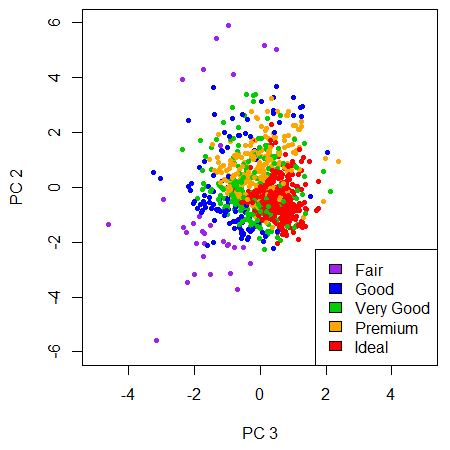

\maketitle

```{r setup, include=FALSE}
knitr::opts_chunk$set(echo = TRUE)
```

```{r echo=FALSE, fig.align='center', out.width='30%'}
# Include images and pictures using .png files.
knitr::include_graphics(c("Images/The_Black_Logo.png"))
```

```{r echo=FALSE,  fig.alt='left', fig.show='asis', out.width='37%'}
# Include images and pictures using .png files.
knitr::include_graphics(c("Images/Space.png"))
```

```{r echo=FALSE,  fig.alt='left', fig.show='asis', out.width='70%'}
# Include images and pictures using .png files.
knitr::include_graphics(c("Images/Diamond3.png","Images/Diamond3.png"))
```

\newpage

```{=latex}
\newpage
\setcounter{tocdepth}{4}
\tableofcontents
```

\newpage

# Contribution Table

Task           |     Oriade    |     Pietro    |
---------------|:-------------:|:-------------:|
**Student ID** |   s172084     |    s231756    |
---------------|---------------|---------------| 
Question A.1   |       x       |               |   
---------------|---------------|---------------|
Question A.2   |       x       |               | 
---------------|---------------|---------------|
Question A.3   |       x       |               | 
---------------|---------------|---------------|
Question B.1   |       x       |               |  
---------------|---------------|---------------|
Question B.2   |       x       |               |
---------------|---------------|---------------|
Question B.3   |       x       |               |
---------------|---------------|---------------|
Question C.1   |               |       x       |
---------------|---------------|---------------|
Question C.2   |               |       x       |
---------------|---------------|---------------|
Question C.3   |               |       x       |
---------------|---------------|---------------|
Question C.4   |               |       x       |
---------------|---------------|---------------|
Question C.5   |               |       x       |
---------------|---------------|---------------|
Exam Problem 1 |       x       |               | 
---------------|---------------|---------------|
Exam Problem 2 |               |       x       |
---------------|---------------|---------------|
Exam Problem 3 |       x       |               |
---------------|---------------|---------------|
Exam Problem 4 |               |       x       |
---------------|---------------|---------------|
Exam Problem 5 |       x       |               |
---------------|---------------|---------------|
Exam Problem 6 |               |       x       | 
------------------------------------------------
                    - https://github.com/s172084/MachiNe_LeaRninG/tree/main


\newpage

# LINEAR REGRESSION
## Section A
### Question 1

**Explain what is predicted based on which other variables, and what you hope to accomplish by the regression.**
**Mention your feature transformation choices such as 1 out of K coding.**
**Apply a feature transformation to your data matrix X, such that each column has a mean of 0 and a standard deviation of 1**

This project uses the Diamonds Dataset from The Grammar of Graphics (**ggplot2**) package, which is part of the TidyVerse package. The Diamonds Dataset contains the Prices and other attributes of over 50,000 round cut diamonds. The package was created by Hadley Wickham and other data scientists to be used with the statistical programming language called R .

Multiple Linear Regression is performed in order to predict the Price of a Diamond based on the other attributes. In this section,  the subgroup of diamonds under analysis come from the **Premium Group** in the colour category **D**. 
This subgroup of diamonds have a varied clarity. 

The continuous attributes such as the carat, the table, the length, the width and the depth of a diamond are used to estimate the price of the diamond. The **“SLM Calculate a prediction”** function takes new observation of a diamond that is 142 mg in weight and predicts that the price of that diamond is £2,909 or approximately DKK 24,830 . 

In terms of feature transformations, the price of a diamond is converted from United States Dollars ($) to Danish Kroner (DKK) , (€) Euro and (£) Pound Sterling. The categorical discrete attributes of diamond colour, diamond clarity and diamond cut have either been removed or one hot encoded for linear regression. This is due to issues with multicollinearity of the dummy variables. 

The measurements of diamond length, width and depth were converted from millimetres (mm) to micrometers (µm). Carat was converted to milligrams (mg) and the outliers, the, values that lie outside of the upper boundary and lower boundaries, were removed. 

In the dataset there are diamonds with a length, width or depth of 0.0 . The smallest measured depth is 1,070 µm and exactly two diamonds have a width of 3,730 µm. The “determine outliers”  function was used to estimate the upper and lower limits to be able to deal with outliers. It was important to deal with outliers, by removing them, due to the fact that these measurements may distort the statistical linear model. 


***


# CLASSIFICATION

## Question 1

:::::: {.cols data-latex=""}
::: {.col data-latex="{0.45\textwidth}"}
Regarding the classification problem, we want to train a model which labels whether a diamond has an *Ideal cut* or not. This aim appears to be feasible according to the projection of data onto the space defined by the first three Principal Components (top figure of page 11 of Report 1). Figure # represents a sample of diamonds projected into the space defined by the second and third Principal Component. It can be seen that by colouring data according to their *cut*, they appear to be clustered, especially the *Ideal* ones. So we aim to find a model which classifies diamonds in two binary classes: *Ideal* and *Non-Ideal* cut, according to their depth, table, price in DKK, carat in milligrams, length, width and depth in micrometers. We choose to use only continuous attributes and to ignore information coming from the color and clarity of diamonds.
:::

::: {.col data-latex="{0.05\textwidth}"}
\ 
:::

::: {.col data-latex="{0.50\textwidth}"}


<span class="caption">Figure #: Sample of diamonds projected onto the space defined by the $2^{nd}$ and $3^{rd}$ Principal component</span>

:::
::::::
\ 

The dataset seems to be almost balanced in the distribution of diamonds between the *Ideal Cut* and the *Non-Ideal Cut*: the number of *Ideal* diamonds is about 21000 (corresponding to the 40 % of the dataset) whereas *Non-Ideal* diamonds are about 32000 (60 % of the dataset). This means that there is no need to re-sample the dataset since the predictors have enough observations of both the possible outcomes.

In order to give the same importance to all the attributes regardless the different scales of variations, each column of the dataset is normalized with respect to its mean and its standard deviation. By doing so, estimated model parameters will be comparable and will tell important information about which attributes most contribute to the *Cut* behavior. The means and the standard deviations of each column are part of the model parameters because a new observation has to be normalized before the application of the classification model.

## Question 2 & 3
Different models can be trained to classify diamonds in *Ideal* and *Non-Ideal* cut. The simplest one is the Baseline (BL), based only on the vector **y** of the outputs. In our case it is represented by the attribute *cut* transformed as follow:
$$ y =
\begin{cases}
1 & \text{if cut = "Ideal"} \\
0 & \text{otherwise}
\end{cases} $$
By computing the average of **y**, we obtain the value of 0.4 (as we found in Question 1). According to this information, the BL model always predicts a new diamond as *Non-Ideal*, regardless its characteristics (depth, table, etc...), with a classification error of 40%. 

The other three models we want to analyse are:

- the Logistic Regression based on a linear combination of the attributes (LRL)
- the Classification Tree (CT)
- the Logistic Regression based on a quadratic combination of the first four Principal Components of the dataset (LRQ)

The choice of training a forth model is made because a quadratic combination of the 7 considered attributes is very hard to be trained (26 new columns representing the quadratic model would be added to the dataset, resulting in an **X** matrix of 33 columns): the computational time is too high and the process does not converge to a solution. So, by reducing the dimensions of the problem thanks to the Principal Component Analysis, we can consider a quadratic combination of the first four Principal Components (the **X** matrix turns out to have only 14 columns).

Each of the three above models requires a complexity parameter managing the regularization of the model. Higher values of the complexity parameter mean that large weights are penalized and data are less important in the training of the model. On the other hand, lower values of the complexity parameters allow the model to better follow data but to be less general in case of new data. 

- Logistic regression models (LRL and LRQ) are regularized by the $\lambda$ parameter, for which we do not know the value. Its value can be chosen by training the same model on the same data but with different values of $\lambda$. As the dataset consists of 53879 diamonds after the cleaning from the outliers, only four values of $lambda$ have been tempted in the training of the LRL and LRQ models. The tempted values are: $\lambda=\{10^{-5},10^{-4},10^{-3},10^{-2}\}$ (the choice of considering so low values is discussed later). We will choose the $\lambda$ associated to the lowest generalization error computed on a dataset of diamonds independent from the one used to train the model.
- Classification Tree is regularized by the $c_P$ parameter (note that $c_P\in[0,1]$). $c_P$ close to zero means more complex decision trees and more importance of data, $c_P$ close to 1 means easier decision trees and less importance to data. The selection of the best value of $c_P$ is the same of the Logistic Regression. The tempted values are: $c_P=\{0.05,0.01,0.005,0.001\}$. In addition, DT is dependent on two more parameters, that are the minimum number of data to create a new node (question) and the minimum number of data to create a leaf. The choice have been arbitrary made by taking them respectively equal to 100 and 1.

The large number of observations leads to choose a "light" cross-validation method, that is the K-fold partition of the dataset with a small number of folds. In particular, we choose four outer partitions and six inner folds. This means that each model will be trained:
$$
\text{Nr. of trainings} = 4 \text{ outer folds } \cdot 6 \text{ inner folds } \cdot 4 \text{ complexity parameters } + 4 \text{ re-trainings } = 100 \text{ times}
$$
Models are trained on the training datasets selected following the cross-validation procedure and tested on independent datasets which have not used to train the models. Given that we choose four outer partition, we obtain four different results per each model and we choose the model parameter associated with the lowest error rate computed as:
$$
E_i^{test} [\%] = \frac{\text{Number of mis-classified data}}{\text{Total number of test data}} \cdot 100 \%
$$

Results of the two-level cross-validation are summarized in the Table #, where in bold are highlighted the lowest error rates per each model and the associated best parameters.

\begin{center}
\begin{tabular}{rrrrrrrr}
\toprule
\multicolumn{1}{c}{Outer fold} & \multicolumn{1}{c}{Base-Line} & \multicolumn{2}{c}{Log. Regr. (Linear)} & \multicolumn{2}{c}{Log. Regr. (Quadratic)} & \multicolumn{2}{c}{Classification Tree} \\
\cmidrule(l{3pt}r{3pt}){1-1} \cmidrule(l{3pt}r{3pt}){2-2} \cmidrule(l{3pt}r{3pt}){3-4} \cmidrule(l{3pt}r{3pt}){5-6} \cmidrule(l{3pt}r{3pt}){7-8}
i & {$E_i^{test} [\%]$} & {$\lambda_i$} & {$E_i^{test} [\%]$} & {$\lambda_i$} & {$E_i^{test} [\%]$} & {$c_{P,i}$} & {$E_i^{test} [\%]$}\\
\midrule
1 & 39.73 & 1e-04 & 19.91 & \textbf{1e-05} & \textbf{12.47} & \textbf{0.005} & \textbf{11.41}\\
2 & 40.44 & \textbf{1e-04} & \textbf{19.81} & 1e-04 & 13.51 & 0.001 & 11.98\\
3 & 40.36 & 1e-05 & 20.33 & 1e-05 & 12.87 & 0.001 & 11.95\\
4 & 39.41 & 1e-04 & 20.42 & 1e-05 & 13.21 & 0.005 & 11.76\\
\bottomrule
\end{tabular}
\end{center}

$$
\text{Table : Results of the two-level cross-validation used to compare models}
$$
As we expected, Baseline error rate is about 40 % per each fold: it varies because the dataset is splitted randomly in the four outer partitions, so each outer fold does not contain the same amount of *Ideal* and *Non-Ideal* diamonds.

Regarding the Logistic Regressions (both linear and quadratic), they consist of solving a linear regression and then applying a sigmoid function in order to project data in the range [0,1]. The linear regression can be solved by the means of the regularized Least Squares[^1], minimizing both the data misfit and the model norm:

[^1]: Aster, Richard C. (2013). Parameter estimation and inverse problems. – 2nd ed., Elsevier Inc., 94-95

$$
min(||X_{train}w-y_{train}||^2_2+\lambda||w||^2_2)
$$
Where *w* is the model vector containing estimated weights of the linear regression. Weights *w* are estimated as follow:
$$
w=(X_{train}^T X_{train}+\lambda I)^{-1}X_{train}y_{train}
$$
By increasing $\lambda$, more importance is given to the model (linear model for the LRL, quadratic model for the LRQ) as the first term of the above equations becomes negligible with respect to the second one, whereas by decreasing $\lambda$ more importance is given to observations (second term negligible with respect to the first one). The regularization parameter $\lambda$ allows to use complex models even in case of small datasets without overfitting the model because it constrains the observations to better follow the model. But in our case, the dataset is very large and the model is very poor with respect to the whole variability of data (it consists in a hyper-plane for the LRL and in a hyper-paraboloid for the LRQ in the multi-dimensional space defined by the attributes) and it does not manage to precisely explain the behavior of the *Cut* of diamonds based on the other attributes. We are somehow facing with a problem of underfitting, which cannot be solved because more complex models would have too many parameters to be estimated. This the reason why we choose to consider only small values of $\lambda$ and Table # confirms that the smallest values of $\lambda$ are the ones giving the smallest error rates. 

Table # shows the estimated weights of the Logistic Regression based on the linear combination of the attributes (LRL). It can be noticed that the highest weights are associated to the *Table* and to the *x dimension* of the diamonds, meaning that the LRL model bases its predictions of the *Cut* mostly on these two variables. 

:::::: {.cols data-latex=""}
::: {.col data-latex="{0.20\textwidth}"}
|Attributes  | Weights|
|:-----------|-------:|
|Intercept   |   -0.84|
|Depth       |   -0.84|
|Table       |   \textbf{-2.23}|
|Price [DKK] |    0.60|
|Carat [mg]  |   -0.83|
|x [µm]      |   \textbf{-1.24}|
|y [µm]      |    0.82|
|z [µm]      |    0.56|
<span class="caption">Table #: estimated weights of the LRL</span>
:::

::: {.col data-latex="{0.05\textwidth}"}
\ 
:::

::: {.col data-latex="{0.20\textwidth}"}
|Variables      | Weights|
|:--------------|-------:|
|Intercept      |   -2.31|
|$PC1$          |    0.53|
|$PC2$          |   \textbf{-1.15}|
|$PC3$          |    \textbf{2.59}|
|$PC4$          |    0.09|
|$PC1^2$        |   -0.13|
|$PC2^2$        |   \textbf{-3.15}|
|$PC3^2$        |   \textbf{-2.54}|
|$PC4^2$        |   -0.13|
|$PC1\cdot PC2$ |    0.21|
|$PC1\cdot PC3$ |   -0.16|
|$PC1\cdot PC4$ |   -0.02|
|$PC2\cdot PC3$ |   \textbf{-0.89}|
|$PC2\cdot PC4$ |   -0.06|
|$PC3\cdot PC4$ |    0.11|
<span class="caption">Table #: estimated weights of the LRQ applied to the Principal Components</span>
:::

::: {.col data-latex="{0.05\textwidth}"}
\ 
:::

::: {.col data-latex="{0.50\textwidth}"}

<span class="caption">Figure #: coefficients of the principal components</span>
:::
::::::

Table # shows the estimated weights of the Logistic Regression based on the quadratic combination of the first four Principal Components (LRQ). Figure # represents how each of the Principal Components depends on the seven attributes. Looking at the weights of the Table #, it can be noticed that the second and third principal components are the most weighted ones, both in their linear and quadratic form. These Principal Components are mostly determined by the *Depth* and *Table* of diamonds (green and cyan bars of Figure #). The result agrees with the Figure ##, showing the almost clear clusters wherein data projected onto the space defined by the second and third Principal Components fall.

:::::: {.cols data-latex=""}
::: {.col data-latex="{0.60\textwidth}"}
As for the Classification Tree, once again the best complexity parameters $c_P$ are the smallest ones, meaning that trees with less branches predict better the *Cut* than more developed trees. The Classification Tree associated with the lowest error rate is plotted in Figure #. As the figure shows, the classification od the diamonds in *Ideal* or *Non-Ideal Cut* is based only on the *Table* and *Depth* of them, regardless all the other attributes. According to Table #, even though the tree is so simple, it better classifies diamonds than the Logistic Regressions, which requires the knowledge of more variables to achieve a worse result.
:::

::: {.col data-latex="{0.05\textwidth}"}
\ 
:::

::: {.col data-latex="{0.35\textwidth}"}

<span class="caption">Figure #: lowest error rate Classification Tree </span>
:::
::::::

## Question 4

\newpage

# Exam Problems

**Question 1**

The answer

*** 

**Question 2**

Answer **D**: we have a dataset of $N=135$ elements, divided in 4 classes as follows: 

37-31-33-34 (R)

By considering a tree made of two branches based on the value of $x_7$, we obtain the two following sub-groups:

$x_7=2$ 0-1-0-0 (A) with $N_2=1$

$x_7 \neq 2$ 37-30-33-34 (B) with $N_2=134$

By computing the *classification error impurity measure* for each branch, we obtain:

$I_R=1-37/135=0.726$; $I_A=1-1=0$; $I_B=1-37/134=0.724$

And finally we can calculate the purity gain based on the rule $x_7=2$:

$\Delta_2=0.726-\frac{134}{135}\cdot 0.724=0.0074$

*** 

**Question 3**

The answer

*** 

**Question 4**

Answer **D**: we concentrate on the class 4 and we notice that it is the only one dependent only on $b_1$ (Fig. 4).
We see from Fig. 3 that rules A and C lead to class 4, so those rules must regard conditions on $b_1$. By looking at
the four possible answers, only answer **D** shows both A and C rules regarding $b_1$.

*** 

**Question 5**

The answer

*** 

**Question 6**

The answer

\newpage

# References

1) Aster, Richard C. (2013). Parameter estimation and inverse problems. – 2nd ed., Elsevier Inc., 94-95

